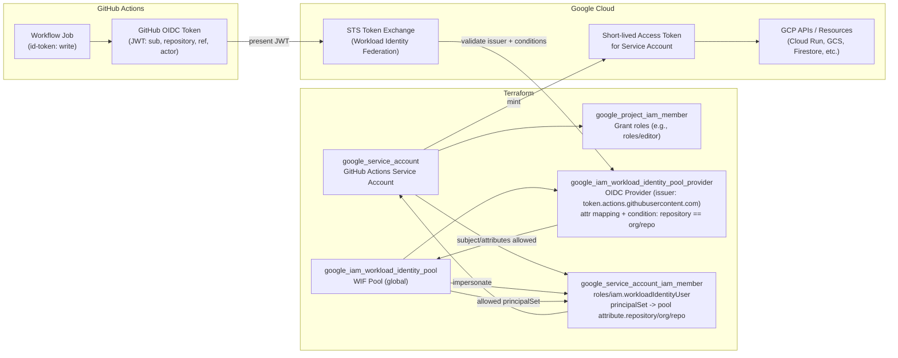

# GCP Workload Identity Federation for GitHub Actions

Terraform configuration to create a Google Cloud Workload Identity Federation (WIF) pool, OIDC provider, and service account that GitHub Actions jobs can impersonate. The setup grants the service account project-level `roles/editor` (adjust as needed) and binds the GitHub repository you specify.

## Requirements
- Terraform `>= 1.13.0`
- Access to the target GCP project with permissions to create IAM, Workload Identity Pool/Provider, and Service Accounts
- `gcloud` CLI (for authentication) and Application Default Credentials (`gcloud auth application-default login`) or `GOOGLE_APPLICATION_CREDENTIALS` pointing to a service account key
- A GCS bucket for the remote Terraform state (edit the `backend "gcs"` bucket/prefix in `versions.tf` if you need a different location)

## Diagram


## Installation
1) Clone this repository:
```bash
git clone https://github.com/your-org/gcp-tf-wif-oidc.git
cd gcp-tf-wif-oidc
```
2) Update variables in `terraform.tfvars` (or set via `-var` flags):
```hcl
project_id         = "your-gcp-project-id"
region             = "us-central1"
org                = "github-org"   # e.g., my-org
service_account_id = "github-oidc-sa"
```
   - `org` must match the GitHub account allowed to assume the identity.
   - `service_account_id` is the short name; the email is derived automatically.

3) (Optional) If you use a different Terraform state bucket/prefix, edit `versions.tf` accordingly.

4) Authenticate to GCP so Terraform can use your credentials:
```bash
gcloud auth application-default login
```
   or set `GOOGLE_APPLICATION_CREDENTIALS` to a service account key file.

## Usage
1) Initialize:
```bash
terraform init -backend-config="bucket=bucket-wif-oidc-tfstate"
```

2) Review the plan:
```bash
terraform plan
```

3) Apply to create the WIF pool, provider, and service account:
```bash
terraform apply
```

4) Capture outputs (for wiring into GitHub Actions):
```bash
terraform output gcp_sa_email
terraform output gcp_wif_provider
```

5) Example GitHub Actions configuration using the created provider and service account:
```yaml
- name: Authenticate to Google Cloud (OIDC)
  uses: google-github-actions/auth@v2
  with:
    workload_identity_provider: ${{ secrets.GCP_WIF_PROVIDER }} # projects/PROJECT_NUMBER/locations/global/workloadIdentityPools/POOL/providers/PROVIDER
    service_account: ${{ secrets.GCP_SA_EMAIL }}                # from terraform output
    project_id: ${{ secrets.GCP_PROJECT_ID }}
```

6) To remove the resources:
```bash
terraform destroy
```

## Notes
- The service account is granted `roles/editor`; tighten this to the minimum set of roles your workloads need.
- The Workload Identity binding restricts access to the repository set in `org_repo`. Update and re-apply if you need to allow a different repo.
